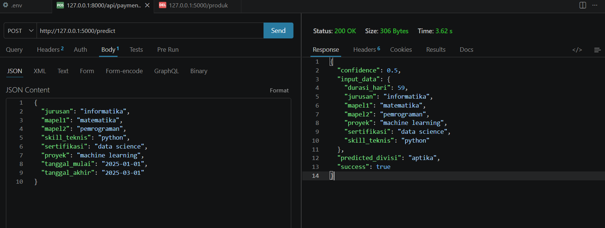

# 🤖 KNN Internship Division Recommendation API

This project implements a Machine Learning model using the **K-Nearest Neighbor (KNN)** algorithm to recommend the most suitable internship division for students based on their profile.

It is developed as part of an undergraduate thesis:

**"Pengembangan Sistem Informasi Administrasi Magang Berbasis Web dengan Penerapan Algoritma K-Nearest Neighbor (KNN) untuk Rekomendasi Divisi Magang."**

---

## 📌 Overview

This system provides **automatic internship division recommendations** based on historical internship data and student attributes.

The model is deployed as a **REST API using Flask**, allowing integration with external backend systems such as Laravel.

---

## 🔄 System Integration

This machine learning model is designed to be part of a larger system:

* Laravel-based web application (frontend + backend)
* Python Flask API (machine learning service)

### Flow:

1. User inputs internship data in web system (Laravel)
2. Backend sends request to ML API (`/predict`)
3. ML API processes data using KNN model
4. API returns recommended division
5. Result is displayed to user

---

## 🚀 Features

* KNN-based classification model
* REST API for prediction
* Input validation & preprocessing
* Confidence score output
* Integration-ready architecture

---

## 📊 Dataset

The dataset contains internship participant records:

| Feature | Description                |
| ------- | -------------------------- |
| Jurusan | Student major              |
| Skill   | Technical skill            |
| Minat   | Student interest           |
| IPK     | GPA                        |
| Divisi  | Target internship division |

---

## ⚙️ Machine Learning Pipeline

1. Data preprocessing
2. Feature encoding
3. Model training using KNN
4. Model serialization (Pickle)
5. Prediction via API

---

## 🔌 API Endpoint

### 🔹 Health Check

```
GET /health
```

### 🔹 Predict Recommendation

```
POST /predict
```

---

## 📥 Example Request

```json
{
  "jurusan": "informatika",
  "mapel1": "matematika",
  "mapel2": "pemrograman",
  "skill_teknis": "python",
  "sertifikasi": "data science",
  "proyek": "machine learning",
  "tanggal_mulai": "2025-01-01",
  "tanggal_akhir": "2025-03-01"
}
```

---

## 📤 Example Response

```json
{
  "success": true,
  "predicted_divisi": "aptika",
  "confidence": 0.87
}
```

---

## 📸 API Preview
This screenshot shows a successful prediction request to the Flask API, returning the recommended internship division along with confidence score.


---

## 📂 Project Structure

```
dataset/      -> dataset for training
model/        -> trained ML model
src/          -> API and model code
config/       -> feature metadata
```

---

## 🛠️ Technologies Used

* Python
* Scikit-learn
* Pandas
* NumPy
* Flask
* Joblib

---
## 🧠 System Architecture

- Laravel (Backend & Web System)
- Flask (Machine Learning API)
- KNN Model (Recommendation Engine)
- MySQL (Database)

Laravel communicates with the Flask API via HTTP request to generate real-time recommendations.

---
## 🎯 Result

The model successfully generates internship division recommendations and demonstrates how machine learning can support decision-making in internship placement systems.

---

## 👩‍💻 Author

Silvy Putri Hanafi
Informatics Engineering – Undergraduate Thesis Project

---

## 📄 License

For academic and research purposes.
